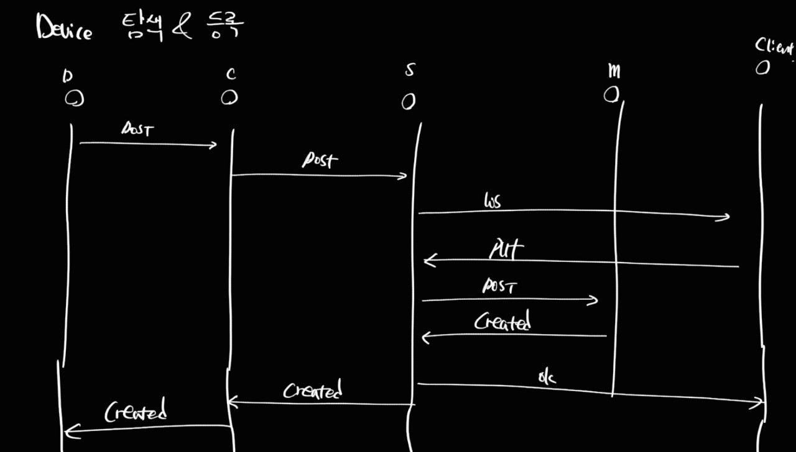

# 디바이스 공통 정보

- 디바이스 이름 / 관리 서비스 이름 / prompt 


# 컨트롤러 및 등록


# 디바이스 탐색 및 등록

- Procedure

> 

- Device -> Controller

  ```json
  {
      "dname": "thermometer",
      "type": "sensor", 
  	"sname": "devicemanagerA",
      "cid": 
  }
  ```

- controller -> server

  ```json
  {
      "name": "temp",
      "type": "sensor", 
      "did": "temp-1",
      "cid": "controller-1",
  	"sid": "devicemanagerA"    
  }
  ```

- client -> server

  ```json
  {
      "did": "thermometer-1"
  }
  ```


# API

- get-services

  - `http://{{server}}/services`

- post-services

  - `http://{{server}}/services`

    ```json
    {
        "name": "devicemanagera"
    }
    ```

- post-controller

  - `http://{{server}}/controllers`

    ```json
    {
        "cname": "controller-A"
    }
    ```

- get-controller

  - `http://{{server}}/controllers`

- post-devices

  - `http://{{server}}/devices`

    ```json
    {
        "dname": "device-A",
        "type": "sensor",
        "cid": "e09c50b3-40d1-4267-888e-272d6a7d4845",
        "sname": "devicemanagerb"
    }
    ```

- get-devices

  - `http://{{server}}/devices`

- put-devices

  - `http://{{server}}/services`

    ```json
    {
        "name": "devicemanagerA",
        "addr": "127.0.1.1:3001"
    }
    ```

    

